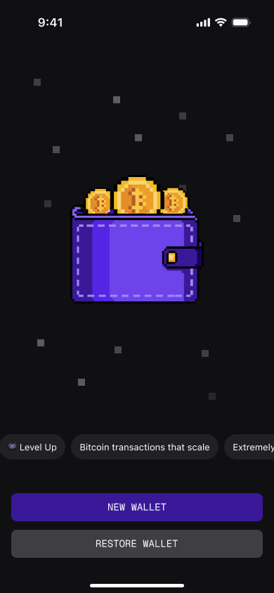
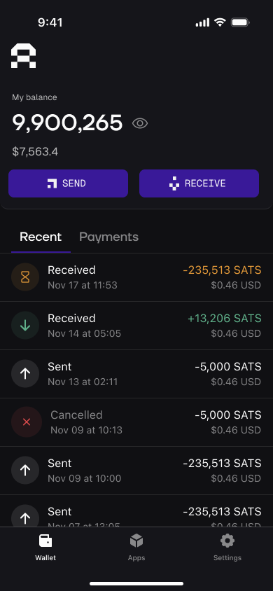

# 👾 Arkade Wallet

Arkade Wallet is the entry-point to the Arkade ecosystem—a self-custodial Bitcoin wallet delivered as a lightweight Progressive Web App (installable on mobile or desktop in seconds, no app-store gatekeepers). Built around the open-source ARK protocol, it speaks natively to any [arkd](https://github.com/arkade-os/arkd) instance, letting you create, send, and receive Virtual Transaction Outputs (VTXOs) for instant, off-chain pre-confirmations and batched, fee-efficient on-chain settlement.

## Screenshots

<!-- Using a table for more consistent layout -->
<table>
  <tr>
    <td width="50%" align="center">
      
    </td>
    <td width="50%" align="center">
      
    </td>
  </tr>
</table>

## Environment Variables

| Variable                      | Description                                                         | Example Value                                      |
| ----------------------------- | ------------------------------------------------------------------- | -------------------------------------------------- |
| `VITE_ARK_SERVER`             | Override the default Arkade server URL                              | `VITE_ARK_SERVER=http://localhost:7070`             |
| `VITE_APP_VERSION`            | App version string shown in support diagnostics                     | `VITE_APP_VERSION=1.2.3`                           |
| `VITE_BOLTZ_URL`              | Override the default Boltz swap provider URL for Lightning          | `VITE_BOLTZ_URL=https://boltz-provider-url.com`    |
| `VITE_CHATWOOT_WEBSITE_TOKEN` | ChatWoot website token for customer support integration             | `VITE_CHATWOOT_WEBSITE_TOKEN=your-token`           |
| `VITE_CHATWOOT_BASE_URL`      | ChatWoot server base URL for customer support integration           | `VITE_CHATWOOT_BASE_URL=https://app.chatwoot.com`  |
| `VITE_LENDASAT_IFRAME_URL`    | Override the default LendaSat URL                                   | `VITE_LENDASAT_IFRAME_URL=http://localhost:5173`   |
| `VITE_LENDASWAP_IFRAME_URL`   | Override the default LendaSwap URL                                  | `VITE_LENDASWAP_IFRAME_URL=http://localhost:5174`  |
| `VITE_MAX_PERCENTAGE`         | Override the max fee percentage (default 10)                        | `VITE_MAX_PERCENTAGE=5`                            |
| `VITE_NOSTR_RELAY_URL`        | Override the default Nostr relay URLs for backup                    | `VITE_NOSTR_RELAY_URL=wss://relay.example.com`     |
| `VITE_PSA_MESSAGE`            | Message to show on the wallet index page                            | `VITE_PSA_MESSAGE=@arkade_os on TG for support`    |
| `VITE_SENTRY_DSN`             | Enable Sentry error tracking (only in production, not on localhost) | `VITE_SENTRY_DSN=your-sentry-dsn`                  |
| `VITE_UTXO_MAX_AMOUNT`        | Override the server's utxoMaxAmount                                 | `VITE_UTXO_MAX_AMOUNT=-1`                          |
| `VITE_UTXO_MIN_AMOUNT`        | Override the server's utxoMinAmount                                 | `VITE_UTXO_MIN_AMOUNT=330`                         |
| `VITE_VERIFIED_ASSETS_URL`    | URL to fetch the verified assets list                               | `VITE_VERIFIED_ASSETS_URL=https://arklabshq.github.io/asset-registry/mutinynet.json` |
| `VITE_VTXO_MAX_AMOUNT`        | Override the server's vtxoMaxAmount                                 | `VITE_VTXO_MAX_AMOUNT=-1`                          |
| `VITE_VTXO_MIN_AMOUNT`        | Override the server's vtxoMinAmount                                 | `VITE_VTXO_MIN_AMOUNT=330`                         |
| `CI`                          | Set to `true` for Continuous Integration environments               | `CI=true`                                          |

## Getting Started

### Prerequisites

- Node.js v20.19+ or v22.12+ (Required by Vite 7)
- PNPM >=8

### Installation

Install dependencies

```bash
pnpm install
```

## Development

### `pnpm run start`

Runs the app in the development mode.\
Open [http://localhost:3002](http://localhost:3002) to view it in the browser.

The page will reload if you make edits.\
You will also see any lint errors in the console.

### `pnpm run build`

Builds the app for production to the `dist` folder.\
It correctly bundles React in production mode and optimizes the build for the best performance.

The build is minified and the filenames include the hashes.\
Your app is ready to be deployed!

### `pnpm run regtest`

Starts the regtest environment and sets up the arkd instance.\
Requires Docker to be installed and [Nigiri](https://nigiri.vulpem.com/) to be running with `--ln` flag.

### Funding your local wallet
To interact with Ark features, you need Regtest coins.
1. Copy your address from the wallet's **Receive** screen (ensure it starts with bcrt1 for Regtest).
2. Run the Nigiri faucet command: 
```bash
nigiri faucet <bcrt-address>
```


### e2e tests

> note: e2e tests require a regtest environment to be running.
> `pnpm run regtest` to start and setup the regtest environment.

> note: e2e tests use playwright for ui testing, you may need to run
> `pnpm exec playwright install` once to download new browsers.

Run the tests with:

```bash
pnpm run test:e2e
```

Run the tests in interactive mode with:

```bash
pnpm run test:e2e --ui
```

Access the playwright code generator tool with:

```bash
pnpm run test:codegen
```

## Troubleshooting
### `address already in use` (Port 5000) on macOS
macOS AirPlay Receiver uses port 5000 by default, which conflicts with Nigiri.
- **Fix:** Go to `System Settings > General > AirDrop & Handoff` and disable **AirPlay Receiver**.

